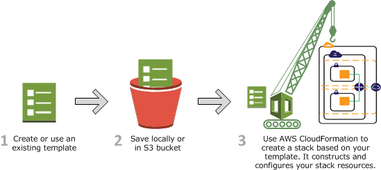

# AWS CloudFormation Masterclass v2 2024

[AWS CloudFormation Masterclass v2 2024](https://www.udemy.com/course/aws-cloudformation-master-class)


## Course Objectives

- Learn CloudFormation and master all its concepts
- Go through hands on examples to practice what we learned
- Learn how to use `YAML` to write CloudFormation templates
- Learn how to write infrastructure as code
- Launch several templates
- Advanced topics like Nested Stacks, Cross Stack References, Macros, StackSets, Drift Detection, Change Sets, etc

## Prerequisites

- Basic knowledge of AWS
  - AWS IAM
  - AWS S3
  - AWS EC2, Security Groups, Autoscaling Groups, etc
  - AWS Lambda
  - A few other services
- Basic knowledge of `YAML` or `JSON` is preferred
- Recent macOS/Linux/Windows machine
- Motivation to learn 🧠

## What is CloudFormation?

- CloudFormation is a declarative way of outlining your AWS Infrastructure
- For example, within a CloudFormation template, you say:
  - I want a security group
  - I want two EC2 instances with this configuration
  - I want an S3 bucket
  - I want a Lambda function
- Then CloudFormation creates those for you, in the right order, with the exact configuration that you specify

Here is an example of a CloudFormation template in `YAML`:

```yaml
Resources:
  MyEC2Instance:
    Type: AWS::EC2::Instance
    Properties:
      AvailabilityZone: us-east-1a
      ImageId: ami-0ff8a91507f77f867
      InstanceType: t2.micro
```

Above is a simple example of a CloudFormation template that creates an EC2 instance. Let me explain what you are 👀 at:

1. `Resources`: This is the section where you define the AWS resources you want to create.
2. `MyEC2Instance`: This is the logical name of the resource. You can use this name to reference this resource in other parts of the template.
3. `Type`: This is the type of AWS resource you want to create. In this case, it's an EC2 instance.
4. `Properties`: These are the properties of the resource. In this case, we are specifying the Availability Zone, the AMI ID, and the Instance Type.
5. `AvailabilityZone`, `ImageId`, `InstanceType`: These are the properties of the EC2 instance that we are creating.

## What are the Benefits of CloudFormation?

- **Infrastructure as Code**
  - No resources are manually created, which is excellent for control.
  - The code can be version controlled for example using Git.
  - Changes to the infrastructure are reviewed through code as pull requests/merge requests.
- **Cost**
  - Each resource within the stack is tagged with an identifier so you can easily see how much a stack costs you.
  - You can estimate the costs of your resources using the CloudFormation template.
  - Savings strategy: In Dev, you could automate the deletion of templates at 5 PM and recreate them at 8 AM, safely.
- **Productivity**
  - Ability to destroy and re-create an infrastructure on the fly.
  - Automate generation of Diagram for your templates!
  - Declarative programming (no need to figure out ordering and orchestration).
- **Separation of concern**: create many stacks for many apps, and many layers. Ex:
  - VPC stacks
  - Network stacks
  - App stacks
- **Don't reinvent the wheel**
  - Leverage existing templates on the web!
  - Leverage the documentation.

## What this course won't do?

- This course won't go over every AWS service because AWS offers around 42.240 products and services.
- Instead we'll go over understanding how to write CF templates in the perfect way
- Then you can apply the same concepts to any AWS service you want

## How does CloudFormation work?

When creating a stack, AWS CloudFormation makes underlying service calls to AWS to provision and configure your resources. CloudFormation can only perform actions that you have permission to do. For example, to create EC2 instances by using CloudFormation, you need permissions to create instances. You'll need similar permissions to terminate instances when you delete stacks with instances. You use AWS Identity and Access Management (IAM) to manage permissions.

The calls that CloudFormation makes are all declared by your template. For example, suppose you have a template that describes an EC2 instance with a t2.micro instance type. When you use that template to create a stack, CloudFormation calls the Amazon EC2 create instance API and specifies the instance type as t2.micro. The following diagram summarizes the CloudFormation workflow for creating stacks.



## Couple of things to keep in mind

1. Key Value Pairs are always capitalized in CloudFormation
2. Any course, and I mean any course that has anything to do with GCP, Azure, or AWS, if the course didn't come out the moment that every single feature you are using in the course did, it's likely that you will have to depend on the documentation, like every good engineer should. Content creators have impossible task of keeping up with the pace of cloud providers. So, if you are following along with this course, and you see that something has changed, please refer to the official documentation. I will do my best to keep the notes up to date, but I can't guarantee that I will be able to do so. DOCS DOCS DOCS!
3. Keep in mind if you are in the CloudFormation UI the events tab shows things in chronological order. So if you are sitting there depending on that to get you by, you will end up mad.


## What is  `yaml`

YAML is a human-readable data serialization standard that can be used in conjunction with all programming languages and is often used to write configuration files.

Here is an example of a `YAML` file:

```yaml
Resources:
  MyEC2Instance:
    Type: AWS::EC2::Instance
    Properties:
      AvailabilityZone: us-east-1a
      ImageId: ami-0ff8a91507f77f867
      InstanceType: t2.micro
```

In the above example, we are creating an EC2 instance using `YAML`.

## What is `JSON`

JSON (JavaScript Object Notation) is a lightweight data-interchange format. It is easy for humans to read and write. It is easy for machines to parse and generate.

Here is an example of a `JSON` file:

```json
{
  "Resources": {
    "MyEC2Instance": {
      "Type": "AWS::EC2::Instance",
      "Properties": {
        "AvailabilityZone": "us-east-1a",
        "ImageId": "ami-0ff8a91507f77f867",
        "InstanceType": "t2.micro"
      }
    }

  }
}
```

In the above example, we are creating an EC2 instance using `JSON`.

So yaml has:

- Key Value Pairs
- Nested Objects
- Support Arrays

> 🧠 If you create a S3 bucket without the attribute bucket_name set you will get a random.

## CloudFormation Update Behavior

- CloudFormation updates resources based on differences between what you submit and stack's current template
- Which method depends on which property you update for a resource.
- Update with no interruptions:
  - Some properties can be updated in place without interruption
  - For example, you can update the tags of an EC2 instance without interruption
- Update with Some interruptions:
  - Some properties can be updated in place with some interruption
  - For example, you can update the instance type of an EC2 instance with some interruption but if you update the EC2 instance type, you will have to stop and start the instance
- Replacement
  - Recreating resource with a new ID
  - Create the new resource, change references from other resources to the new resource, then deleted the old resource.
  - Example: updating an RDS DB instance AZ will require replacement

> 🧠 To delete an S3 bucket it needs to be **empty**.

## Understanding the CF Options

- Tags: Key Value pairs to help you identify your stacks
- Permissions: IAM permissions to create, update, delete stacks
- Notification Options: SNS topics to get notification on stack events
- Rollback on failure: Yes or No
- Rollback Configuration: (monitoring time and CloudWatch alarm)
- Stack Policy: JSON to control updates to specific resources
- Termination Protection: Protect against accidental deletion
- Quick-start Link: Pre-populate the stack with a template

## CloudFormation Building Blocks

- Template's components
- AWSTemplateFormatVersion: identifies the capabilities of the template
- Description: describes the template
- Transform: specifies one or more macros that AWS CloudFormation uses to process your template
- Metadata: objects that provide additional information about the template
- Resources: specifies the stack resources and their properties. MANDATORY
- Parameters: values to pass to your template at runtime
- Mappings: static variables for your template
- Conditions: List of conditions to perform resource creation
- Rules: validate a parameter or a combination of parameters during stack creation/update
- Template's helpers
  - References: `Ref` and `Fn::GetAtt`
  - Functions: `Fn::`
  - Pseudo Parameters: `AWS::AccountId`, `AWS::Region`, etc
  - Intrinsic Functions: `Fn::Base64`, `Fn::FindInMap`, `Fn::GetAZs`, `Fn::Join`, `Fn::Select`, `Fn::Split`, `Fn::Sub`, `Fn::Transform`, `Fn::And`, `Fn::Equals`, `Fn::If`, `Fn::Not`, `Fn::Or`
  - Conditions Functions: `Fn::And`, `Fn::Equals`, `Fn::If`, `Fn::Not`, `Fn::Or`

## Parameters

Parameters in CloudFormation are a powerful way to customize your AWS infrastructure deployments. Here’s a breakdown of what they are and how they work:

### **Purpose of Parameters**
   - **Customization**: Parameters allow you to pass values to your CloudFormation template at runtime, without having to hard-code them into the template. This makes your templates more reusable and flexible.
   - **Input Validation**: You can define the type of the parameter and constraints (like min/max value, allowed patterns, and allowed values) to ensure that the input is valid before the template is executed.

### **Types of Parameters**
   - **String**: General text, can include numbers.
   - **Number**: Numeric values, both integers, and floating points.
   - **List**: Sets of values that are passed as a single parameter. You can specify a list of numbers, strings, or AWS-specific types like a list of EC2 instance IDs.
   - **CommaDelimitedList**: A list of values that AWS CloudFormation passes to your script as a comma-separated list (e.g., for passing multiple values like in subnets or security groups).
   - **AWS-specific parameter types**: Such as `AWS::EC2::KeyPair::KeyName`, which requires the name of an existing EC2 KeyPair.

### **Using Parameters**
To define a parameter in a CloudFormation template, you add an entry in the `Parameters` section of the template. Here's an example of a simple string parameter:

```yaml
Parameters:
  InstanceTypeParameter:
    Type: String
    Default: t2.micro
    Description: Enter the instance type for the EC2 instance.
    AllowedValues:
      - t2.micro
      - m1.small
      - m1.large
    ConstraintDescription: Must be a valid EC2 instance type.
```

### **Referencing Parameters**
You can reference parameters anywhere in your template with the `Ref` function. For example:

```yaml
Resources:
  EC2Instance:
    Type: 'AWS::EC2::Instance'
    Properties:
      InstanceType: !Ref InstanceTypeParameter
      ImageId: 'ami-0c55b159cbfafe1f0'
```

### **Advanced Features**
   - **Pseudo Parameters**: AWS provides certain pseudo parameters that you can use in your templates. These are parameters that AWS sets automatically, like `AWS::AccountId`, `AWS::Region`, and `AWS::StackId`.
   - **NoEcho**: For sensitive information, such as passwords, you can set the `NoEcho` property to `true` to prevent the value from being returned by describe or list actions.

[AWS Parameter Docs](https://docs.aws.amazon.com/AWSCloudFormation/latest/UserGuide/parameters-section-structure.html)

## SSM Parameter Type

- Reference parameter in System Parameter Manager
- Specify SSM parameter key as the value
- Cloudformation always fetches the latest value(you can't use a specific version)
- CF does not store Secure String values
- Validation done on SSM parameter keys but not on the values
- Supported SSM Parameter Types:
  - `AWS::SSM::Parameter::Name`
  - `AWS::SSM::Parameter::Value<String>`
  - `AWS::SSM::Parameter::Value<List<String>>`
  - `AWS::SSM::Parameter::Value<CommaDelimitedList>`
  - `AWS::SSM::Parameter::Value<AWS-Specific Parameter>`
  - `AWS::SSM::Parameter::Value<List<AWS-Specific Parameter>>`

Example: Fetch Latest AMI ID's

```yaml
Parameters:
  LatestAMIId:
    Type: 'AWS::SSM::Parameter::Value<String>'
    Default: /aws/service/ami-amazon-linux-latest/amzn2-ami-hvm-x86_64-gp2
    Description: Enter the latest AMI ID for the EC2 instance.
```

## Resources

- Resources are the core of your CloudFormation template
- Each resource will have a type, a name, and properties
- Resources are declared and can reference each other
- Resources can be of different types (AWS::EC2::Instance, AWS::S3::Bucket, etc)
- Resources can have metadata, attributes, and update policies
- Resources can have deletion policies (what happens when you delete the stack)
- Resources can have dependencies on each other
- Resources can have outputs (return values)
- Resources can have conditions (if statements)
- Resources can have transformations (macros)
- Resources can have creation policies (wait for an S3 bucket to be created)
- Resources can have update policies (how to handle updates)
- Resources can have deletion policies (what to do when you delete the stack)

## Optional Attributes for Resources

- `DependsOn`
  - useful to draw dependencies between resources
  - CloudFormation will make sure that resources are created in the right order
- `DeletionPolicy`
  - `Delete` (default): resource will be deleted when the stack is deleted
  - `Retain`: resource will be retained when the stack is deleted
  - `Snapshot`: resource will be retained as a snapshot when the stack is deleted
- `UpdatePolicy`
  - `AutoScalingReplacingUpdate`: The resource will be replaced by an updated resource
  - `AutoScalingRollingUpdate`: The resource will be updated in batches
  - `AutoScalingScheduledAction`: The resource will be updated based on a scheduled action
- `CreationPolicy`
  - `ResourceSignal`: Wait for a signal (URL) or a timeout
  - Useful for EC2 instances to wait for the instance to be ready
- `Metadata`
  - Data about the resource
  - Can be used by CloudFormation to make decisions
- `Outputs`
  - Return values of the resources
  - Can be imported into other stacks
- `Condition`
  - Condition to create the resource
  - Can be used to create resources based on environment (dev, prod)
- `Transform`
  - Macros to process the template
  - Useful for code reuse

## `DeletionPolicy`

In AWS CloudFormation, the `DeletionPolicy` attribute allows you to specify what should happen to a resource when its stack is deleted. This attribute can be particularly useful for managing critical resources that you want to retain or back up even after the stack that created them is deleted.

- Control what happens when CF template is deleted or when resource is removed from the template
- Use with any resource
- `DeletionPolicy=Retain`
  - Specifies that the resource will be retained when the stack is deleted
  - To Keep a resource, specify a `DeletionPolicy` of `Retain`
- `DeletionPolicy=Snapshot`
  - Specifies that the resource will be retained as a snapshot when the stack is deleted
  - Useful for resources that support snapshots (like RDS, EBS, Redshift)
- `DeletionPolicy=Delete`
  - Specifies that the resource will be deleted when the stack is deleted
  - This is the default behavior

There are three possible values for the `DeletionPolicy` attribute:

1. **Delete**: This is the default behavior if no `DeletionPolicy` is specified. The resource is deleted when the stack is deleted.
2. **Retain**: This ensures that the resource is not deleted when the stack is deleted. Instead, it remains in your account. This can be useful for preserving data or configurations that are still needed.
3. **Snapshot**: This applies to resources that support snapshots (such as Amazon RDS, Amazon EBS, and Amazon Redshift). When the stack is deleted, a snapshot of the resource is created and retained. This is useful for retaining the state of the resource at the time of stack deletion.

Here is an example of how to use `DeletionPolicy` in a CloudFormation template:

```yaml
Resources:
  MyBucket:
    Type: AWS::S3::Bucket
    DeletionPolicy: Retain

  MyDatabase:
    Type: AWS::RDS::DBInstance
    DeletionPolicy: Snapshot
    Properties:
      DBInstanceClass: db.t2.micro
      Engine: MySQL
      MasterUsername: admin
      MasterUserPassword: password
      AllocatedStorage: 20
```

In this example:

- `MyBucket` is an S3 bucket that will not be deleted when the stack is deleted due to the `Retain` policy.
- `MyDatabase` is an RDS instance that will have a snapshot taken before it is deleted, thanks to the `Snapshot` policy.

By using the `DeletionPolicy` attribute, you can manage your AWS resources more effectively and ensure that critical data or configurations are not inadvertently lost.

## `UpdateReplacePolicy`

- `UpdateReplacePolicy` attribute is used to specify what happens when a resource is replaced during an update
- This attribute is useful when you want to control the behavior of a resource when it is updated
- There are two possible values for the `UpdateReplacePolicy` attribute:
  - `Delete`: The resource will be deleted and recreated when it is updated
  - `Retain`: The resource will be retained when it is updated
- By default, resources are replaced during an update
- You can use the `UpdateReplacePolicy` attribute to specify that a resource should be retained when it is updated
- This can be useful for preserving data or configurations that are still needed

## FAQ for resources

- Can I create a dynamic number of resources?
  - Yes, you can use CF Macros and Transformations
- Is every AWS Service supported?
  - Almost. Only a select few niches are not there yet.
  - You can work around that by using custom resources

## Mappings

- Mappings are fixed variables within your CF template
- They are very handy to differentiate between different environments (dev, test, prod)
- They can be used to map values based on a key
- They can be nested
- They can be referenced using the `Fn::FindInMap` function

## When would you use mappings vs Parameters

- Use mappings when you know in advance all the values that can be taken and that they are static
- Use parameters when the values are user-specific or environment-specific
- Use mappings for AMI mappings (region, OS type)
- Use parameters for instance type, key pair, etc

## Concept: Pseudo Parameters

- AWs offers us pseudo parameters that can be used at any time in your CF template
- They are AWS specific and are used to return information about the stack, region, account, etc

Pseudo parameters are parameters that are predefined by AWS CloudFormation. You don't declare them in your template. Use them the same way as you would a parameter, as the argument for the `Ref` function.

## Pseudo Parameters Example

The following snippet assigns the value of the `AWS::Region` pseudo parameter to an output value:

### JSON for `AWS::Region`

```json
"Outputs" : {
  "MyStacksRegion" : { "Value" : { "Ref" : "AWS::Region" } }
}
```

### YAML for `AWS::Region `

```yaml
Outputs:
  MyStacksRegion:
    Value: !Ref "AWS::Region"`
```

## `AWS::AccountId`

Returns the AWS account ID of the account in which the stack is being created, such as `123456789012`.

## `AWS::NotificationARNs`

Returns the list of notification Amazon Resource Names (ARNs) for the current stack.

To get a single ARN from the list, use [Fn::Select](https://docs.aws.amazon.com/AWSCloudFormation/latest/UserGuide/intrinsic-function-reference-select.html).

### JSON for `AWS::NotificationARNs`

```json
"myASGrpOne" : {
  "Type" : "AWS::AutoScaling::AutoScalingGroup",
  "Version" : "2009-05-15",
  "Properties" : {
    "AvailabilityZones" : [ "us-east-1a" ],
    "LaunchConfigurationName" : { "Ref" : "MyLaunchConfiguration" },
    "MinSize" : "0",
    "MaxSize" : "0",
    "NotificationConfigurations" : [{
        "TopicARN" : { "Fn::Select" : [ "0", { "Ref" : "AWS::NotificationARNs" } ] },
        "NotificationTypes" : [ "autoscaling:EC2_INSTANCE_LAUNCH", "autoscaling:EC2_INSTANCE_LAUNCH_ERROR" ]
    }]
  }
}
```

### YAML for `AWS::NotificationARNs`

```yaml
myASGrpOne:
  Type: AWS::AutoScaling::AutoScalingGroup
  Version: '2009-05-15'
  Properties:
    AvailabilityZones:
    - "us-east-1a"
    LaunchConfigurationName:
      Ref: MyLaunchConfiguration
    MinSize: '0'
    MaxSize: '0'
    NotificationConfigurations:
    - TopicARN:
        Fn::Select:
        - '0'
        - Ref: AWS::NotificationARNs
      NotificationTypes:
      - autoscaling:EC2_INSTANCE_LAUNCH
      - autoscaling:EC2_INSTANCE_LAUNCH_ERROR`
```

## `AWS::NoValue`

Removes the corresponding resource property when specified as a return value in the `Fn::If` intrinsic function.

For example, you can use the `AWS::NoValue` parameter when you want to use a snapshot for an Amazon RDS DB instance only if a snapshot ID is provided. If the `UseDBSnapshot` condition evaluates to true, CloudFormation uses the `DBSnapshotName` parameter value for the `DBSnapshotIdentifier` property. If the condition evaluates to false, CloudFormation removes the `DBSnapshotIdentifier` property.

### JSON for `AWS::NoValue`

```json
"MyDB" : {
  "Type" : "AWS::RDS::DBInstance",
  "Properties" : {
    "AllocatedStorage" : "5",
    "DBInstanceClass" : "db.t2.small",
    "Engine" : "MySQL",
    "EngineVersion" : "5.5",
    "MasterUsername" : { "Ref" : "DBUser" },
    "MasterUserPassword" : { "Ref" : "DBPassword" },
    "DBParameterGroupName" : { "Ref" : "MyRDSParamGroup" },
    "DBSnapshotIdentifier" : {
      "Fn::If" : [
        "UseDBSnapshot",
        {"Ref" : "DBSnapshotName"},
        {"Ref" : "AWS::NoValue"}
      ]
    }
  }
}
```

### YAML for `AWS::NoValue`

```yaml
MyDB:
  Type: AWS::RDS::DBInstance
  Properties:
    AllocatedStorage: '5'
    DBInstanceClass: db.t2.small
    Engine: MySQL
    EngineVersion: '5.5'
    MasterUsername:
      Ref: DBUser
    MasterUserPassword:
      Ref: DBPassword
    DBParameterGroupName:
      Ref: MyRDSParamGroup
    DBSnapshotIdentifier:
      Fn::If:
        - UseDBSnapshot
        - Ref: DBSnapshotName
        - Ref: AWS::NoValue`
```

## `AWS::Partition`

Returns the partition that the resource is in. For standard AWS Regions, the partition is `aws`. For resources in other partitions, the partition is `aws-``partitionname`. For example, the partition for resources in the China (Beijing and Ningxia) Region is `aws-cn` and the partition for resources in the AWS GovCloud (US-West) region is `aws-us-gov`.

## `AWS::Region`

Returns a string representing the Region in which the encompassing resource is being created, such as `us-west-2`.

## `AWS::StackId`

Returns the ID of the stack as specified with the `aws cloudformation create-stack` command, such as `arn:aws:cloudformation:us-west-2:123456789012:stack/teststack/51af3dc0-da77-11e4-872e-1234567db123`.

## `AWS::StackName`

Returns the name of the stack as specified with the `aws cloudformation create-stack` command, such as `teststack`.

## `AWS::URLSuffix`

Returns the suffix for a domain. The suffix is typically `amazonaws.com`, but might differ by Region. For example, the suffix for the China (Beijing) Region is `amazonaws.com.cn`.

## Outputs

In AWS CloudFormation, **Outputs** are used to return values from your stack. These values can be useful for various purposes, such as:

1. **Displaying Information**: Outputs can display information about the resources created in the stack, such as the URL of a website or the ID of an instance.
2. **Cross-Stack References**: Outputs can be used to export values that can be imported into other stacks, facilitating cross-stack references.
3. **Stack Outputs in AWS Management Console**: Outputs are displayed in the AWS Management Console, making it easier to view important information about your stack.

### Defining Outputs

Outputs are defined in the `Outputs` section of an AWS CloudFormation template. Each output can include the following properties:

- **Description**: A string that describes the output value.
- **Value**: The value of the output. This can be a literal string, a reference to a resource, or an intrinsic function.
- **Export**: Specifies the name of the value to export. This is used for cross-stack references.

### Example

Here is an example of how to define outputs in a CloudFormation template:

```yaml
Outputs:
  InstanceId:
    Description: The instance ID of the web server
    Value: !Ref WebServerHost

  WebsiteURL:
    Description: URL for newly created LAMP stack
    Value: !Sub 'http://${WebServerHost.PublicDnsName}'

  PublicIP:
    Description: Public IP address of the web server
    Value: !GetAtt WebServerHost.PublicIp
```

In this example:
- `InstanceId` returns the ID of the web server instance.
- `WebsiteURL` returns the URL of the newly created LAMP stack.
- `PublicIP` returns the public IP address of the web server.

### Using Outputs for Cross-Stack References

To export an output value for use in other stacks, you can use the `Export` property:

```yaml
Outputs:
  VPCId:
    Description: The ID of the VPC
    Value: !Ref MyVPC
    Export:
      Name: MyVPCId
```

In another stack, you can import this value using the `Fn::ImportValue` intrinsic function:

```yaml
Resources:
  MyInstance:
    Type: AWS::EC2::Instance
    Properties:
      VpcId: !ImportValue MyVPCId
```

### Best Practices

- **Meaningful Names**: Use meaningful names for your outputs to make it clear what value is being returned.
- **Descriptions**: Always provide descriptions for your outputs to make it easier to understand their purpose.
- **Cross-Stack References**: Use outputs and exports to share values between stacks, promoting modular and reusable CloudFormation templates.

## Conditions

In AWS CloudFormation, **Conditions** determine resource creation, updates, or deletion based on specific criteria, supporting template logic.

## `Fn::GetAtt`

The `Fn::GetAtt` function retrieves resource attributes, e.g., EC2 IP address or S3 DNS name.
